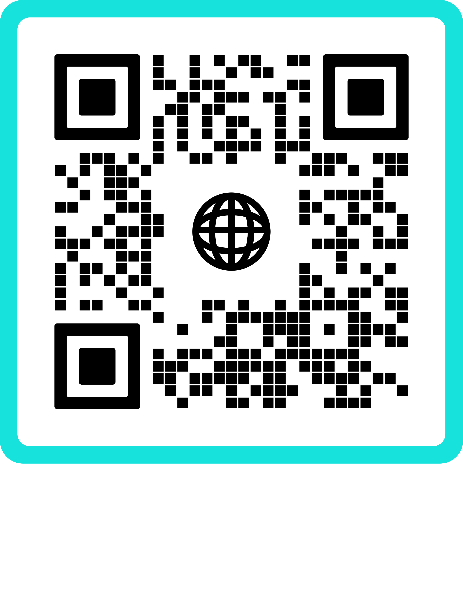

--- 
layout: cv
title: Sean Lo's Resume
--- 

  

# Sean  Lo 

  <a>                                                                   seanlo@outlook.com      |          </a>
  <a>                                                510-386-8647                </a>
  <a href="https://seanlo.netlify.app">           | seanlo.netlify.app      |   </a>
  <a href="https://www.linkedin.com/in/syranol">     linkedin.com/in/syranol     </a>
  <a href="https://github.com/syranol">           | github.com/syranol          </a>

## Technical Skills

*  **Languages**: Python, Bash, JavaScript, TypeScript, C, C++, Java, Groovy, SQL, HTML5/CSS3 
*  **Data & Infra**: AWS, PostgreSQL, MongoDB, Grafana, PyTorch 
*  **Automation & Frameworks**: Appium, Selenium, Pytest, Jenkins, Docker, Kubernetes, Terraform 
*  **Other Tools**: Git, REST, GraphQL, CI/CD Pipelines 

<!--   
  **Languages:** Python, JavaScript, Bash, C/C++, Groovy, SQL, HTML5/CSS3

> **Tools/Frameworks:** Git, AWS, Jenkins, Selenium, Docker, Kubernetes, Appium, GraphQL, REST, React, Node.js, Django, PostgreSQL, Grafana, PyTorch -->

## Experience

### **Software Engineer** -  *Apple*

 Cupertino, CA  Apr. 2024 - Sep. 2025 

* Architected and led development of a Python-based automation framework, enabling large-scale, reliable anti-spoofing data collection (160,000+ datasets annually) supporting Face ID and Optic ID development.
* Improved throughput and fault tolerance by implementing recovery mechanisms, advanced debugging tools, and parallelized workflows with multithreading/multiprocessing.
* Built secure, compliant data pipelines with validation, sanitization, and access controls, ensuring data integrity and privacy.
* Partnered with QA, Research, and ML teams to deliver high-quality datasets and tooling, bridging software engineering, data engineering, and ML workflows.
* Enabled org-wide framework adoption by driving documentation, training, and mentorship.
* Contributed to next-generation initiatives by delivering scalable, cloud-ready automation systems at the intersection of software engineering and machine learning.

### **Software Engineer II** -  *PlayStation (Sony)*

 San Francisco, CA  Nov. 2021 - Mar. 2024 

* Drove development of a Python-based Appium Client/Server pytest testing framework, the backbone of end-to-end testing for QA and developer teams, adopted by 1,000+ users across PS4, PS5, Windows, and Web.
* Standardized CI/CD pipelines for 50+ teams, accelerating release velocity and reliability org-wide.
* Scaled adoption of automation frameworks org-wide through workshops and tutorials for 200+ developers, mentoring peers and elevating engineering efficiency across multiple teams.
* Served as product owner for localization automation, reducing QA cycles and accelerating global releases.
* Owned and scaled a PlayStation Network developer automation tool (Node.js, MongoDB) processing 100,000+ weekly API/Web/CLI calls, a critical service for dev and QA workflows.
* Streamlined Python tooling across 20+ teams, enhancing maintainability and regression reliability.
* Built telemetry and monitoring pipelines (Python, MongoDB, Grafana) that gave stakeholders actionable KPIs, enabling data-informed engineering and business decisions.

### **Software Development Engineer in Test** - *PlayStation (Sony)* 

 San Francisco, CA Mar. 2021 - Nov. 2021

* Supported the launch of PlayStation Direct in Europe (10+ countries, 10M+ monthly visitors) by building automated end-to-end checkout test suites with full coverage.
* Developed and enhanced Selenium/WebDriver frameworks (JavaScript, Groovy, Jenkins) to automate web interactions and integrate CI/CD pipelines, reaching 100% test stability and release efficiency.
* Ehanced internal JavaScript Selenium WebDriver libraries for interacting with Web interfaces on the PlayStation websites, ensuring robust and efficient testing processes

### **Release Engineer** - *Environmental Systems Research Institute (Esri)*

 Redlands, CA Jun. 2020 - Mar. 2021

* Oversaw release automation for ArcGIS enterprise products (1B+ daily calls across 6 platforms), developing Python/Selenium/Jenkins scripts and collaborating with engineers to ensure high-quality, stable releases.

### __Software Engineer Intern - *First International Computing (FIC)*__ <a href="https://www.linkedin.com/in/syranol/overlay/1583300266405/single-media-viewer/?type=DOCUMENT&profileId=ACoAABPldJ0BFSjGL3EC_DYMnNJCZ6ongKLGV8o](https://www.linkedin.com/in/syranol/overlay/1583300266405/single-media-viewer?type=DOCUMENT&profileId=ACoAABPldJ0BFSjGL3EC_DYMnNJCZ6ongKLGV8o&lipi=urn%3Ali%3Apage%3Ad_flagship3_profile_view_base%3Bx6lRpc6VRv6h80zWrUTwyw%3D%3D](https://www.linkedin.com/in/syranol/overlay/1583300266405/single-media-viewer?type=DOCUMENT&profileId=ACoAABPldJ0BFSjGL3EC_DYMnNJCZ6ongKLGV8o&lipi=urn%3Ali%3Apage%3Ad_flagship3_profile_view_base%3BKydn0%2FLdQY6Ut2HiDrOFtw%3D%3D">  Presentation  </a> 

 Fremont, CA Jun. 2019 - Sep. 2019

* Built data collection tools (JavaScript, Node.js, React, MySQL, AWS) and implemented Java Native Access (JNA) to streamline C-to-Java conversion, reducing SDLC by 80%

## Education
**B.S. Computer Science** - *Oregon State University*  Sep. 2017 - Dec. 2019 

**B.A. Business Economics** - *University of California, Riverside*  Sep. 2013 - Jun. 2017 
